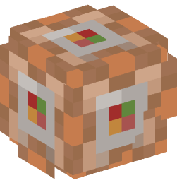

#  DedicatedPower

<p align="center">
  <a href="https://modrinth.com/mod/server-os"></a>
</p>

<p align="center">
  <a href="https://modrinth.com/mod/server-os"></a>
  <a href="https://modrinth.com/mod/server-os"></a>
  <a href="https://modrinth.com/mod/server-os"></a>
  <a href="https://github.com/PiBOH/DedicatedPower/releases"></a>
  <a href="LICENSE"></a>
</p>

<p align="center">
  
  
  
</p>

DedicatedPower is a Fabric mod that improves the graphical interface of a Minecraft dedicated server.

> **Modrinth page:** <https://modrinth.com/mod/server-os>


It replaces the default server administration window with a cleaner interface for monitoring the server, viewing online players, running commands, and accessing common server controls.

## Compatibility

- **Minecraft:** Java Edition 26.2 (Chaos Cubed)
- **Platform:** Fabric
- **Environment:** Dedicated servers only
- **Fabric Loader:** 0.19.3 or newer
- **Java:** 25 or newer
- **License:** [MIT](LICENSE)

DedicatedPower is not intended for single-player worlds or the integrated server.

## Links

- [Modrinth page](https://modrinth.com/mod/server-os)
- [GitHub repository](https://github.com/PiBOH/DedicatedPower)
- [Releases](https://github.com/PiBOH/DedicatedPower/releases)

## Features

### Dedicated server interface

- Custom server GUI for dedicated servers
- Server menu bar with common administration actions
- Quick access to saving worlds, reloading data packs, and stopping the server
- World controls for time and weather
- Command dialog for running server commands

### Console and commands

- Live server log output with color-coded log levels
- Dedicated command console panel
- Command execution directly from the GUI
- Command history with the Up and Down arrow keys
- Clearable console output

### Player management

- Online player list
- Player name filtering
- Game mode display
- Refreshable player information

### Server monitoring

- Current TPS estimate
- Average tick time
- Online player count
- Loaded level count
- Compact statistics panel integrated into the server GUI

## Installation

1. Install [Fabric Loader](https://fabricmc.net/use/installer/) for Minecraft 26.2.
2. Install [Fabric API](https://modrinth.com/mod/fabric-api) for Minecraft 26.2.
3. Install Java 25 or newer.
4. Download the latest DedicatedPower release from the [Releases](https://github.com/PiBOH/DedicatedPower/releases) page.
5. Place the DedicatedPower `.jar` file in the server's `mods` folder.
6. Start the dedicated server.

Always make a backup of your server before installing or updating mods.

## Usage

DedicatedPower is loaded automatically when the dedicated server starts. The enhanced server window is created by the mod and can be used to monitor the server and run commands. The console panel streams live server log output with color-coded levels and accepts commands entered through the GUI.

Use the **Server**, **World**, and **Tools** menus to access the available controls. Commands should be entered without the leading slash, for example:

```text
save-all
```

## Building from source

### Requirements

- JDK 25
- Git
- Internet access for Gradle and Minecraft dependencies

### Build commands

Clone the repository and build the mod with the Gradle wrapper:

```bash
git clone https://github.com/PiBOH/DedicatedPower.git
cd DedicatedPower
./gradlew build
```

On Windows, use:

```bat
gradlew.bat build
```

The compiled files are generated in `build/libs/`.

## Development status

DedicatedPower is actively being updated for Minecraft 26.2. The project uses the official Minecraft names and the non-remapping Fabric Loom toolchain introduced for newer unobfuscated Minecraft versions.

The project currently focuses on the dedicated server GUI and administration workflow. Some advanced features from earlier versions may be reintroduced or expanded in future updates.

## Reporting issues

Before opening an issue, make sure that:

- You are using Minecraft 26.2.
- You are using Java 25 or newer.
- You are using compatible Fabric Loader and Fabric API versions.
- You have searched existing issues.
- You have included the relevant server log or crash report.

Use the repository's [English bug report form](https://github.com/PiBOH/DedicatedPower/issues/new/choose) for bug reports. Use [GitHub Discussions](https://github.com/PiBOH/DedicatedPower/discussions) for general questions and setup help.

## Authors

- @SuperSirvu
- @PiBOH
- @SuperPro5454

## License

DedicatedPower is licensed under the [MIT License](LICENSE).

Enjoy running your dedicated server.
